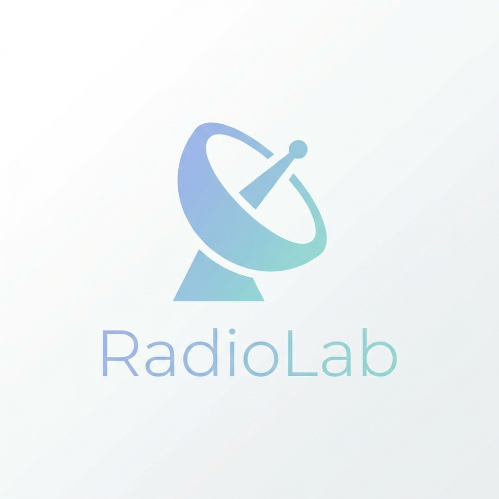

<p align="center">
  
</p>

<h1 align="center">RadioLab</h1>

<p align="center">
  <strong>Post-processing toolkit for radio astronomy images</strong>
</p>

<p align="center">
  <a href="#installation">Installation</a> •
  <a href="#quick-start">Quick Start</a> •
  <a href="#command-line-tools">CLI Tools</a> •
  <a href="#python-api">Python API</a>
</p>

---

## Features

- 📡 **Spectral Cube Creation** — Build cubes from multi-frequency FITS images
- 📊 **Spectral Index Fitting** — Configurable polynomial order (α, β, higher orders)
- 🔭 **Automatic Beam Matching** — Smooth images to common resolution
- 🎯 **Region Support** — Resolved and integrated spectra from DS9 regions
- 📈 **Full Error Propagation** — Uncertainty maps for all fitted parameters
- ⚡ **Auto-Detection** — Reads frequencies and beams directly from FITS headers

## Installation

```bash
git clone https://github.com/arpan/radiolab.git
cd radiolab
pip install -e .
```

## Quick Start

```bash
# Create a spectral cube (frequencies auto-detected from headers)
radiolab-cube "images/*.fits" -o cube.fits

# Fit spectral index
radiolab-spectral cube.fits -o results --order 1

# Fit spectral index + curvature
radiolab-spectral cube.fits -o results --order 2

# Extract integrated spectrum from a region
radiolab-region cube.fits source.reg -o spectrum.txt
```

---

## Command-Line Tools

> **Note:** Frequencies and beams are automatically read from FITS headers. If images have different beam sizes, they are smoothed to either `--beam` (if specified) or the **lowest resolution** (largest beam) among the inputs.

### `radiolab-cube` — Create Spectral Cubes

```bash
# Auto-detect frequencies from FITS headers
radiolab-cube "images/*.fits" -o cube.fits

# With explicit frequencies
radiolab-cube "images/*.fits" -f 1.4GHz,1.5GHz,1.6GHz -o cube.fits

# Crop to central 512×512 pixels
radiolab-cube "images/*.fits" -o cube.fits --zoom 512

# Smooth to specific beam (bmaj, bmin, bpa in arcsec, arcsec, degrees)
radiolab-cube "images/*.fits" -o cube.fits --beam 10,10,0
```

### `radiolab-spectral` — Fit Spectral Index/Curvature

```bash
# Fit spectral index only (α)
radiolab-spectral cube.fits -o spectral --order 1

# Fit spectral index + curvature (α, β)
radiolab-spectral cube.fits -o spectral --order 2

# From individual images
radiolab-spectral "images/*.fits" -o spectral

# Custom RMS and sigma threshold
radiolab-spectral cube.fits -o spectral --rms 1e-4 --sigma 5
```

**Output files:**
| File | Description |
|------|-------------|
| `{prefix}_spectral_index.fits` | Spectral index (α) map |
| `{prefix}_spectral_index_error.fits` | Error on α |
| `{prefix}_curvature.fits` | Curvature (β) map (if order ≥ 2) |
| `{prefix}_curvature_error.fits` | Error on β |
| `{prefix}_chi2.fits` | Reduced χ² map |
| `{prefix}_mask.fits` | Fitted pixels mask |

### `radiolab-region` — Region-Based Spectra

```bash
# Integrated spectrum from DS9 region
radiolab-region cube.fits source.reg -o spectrum.txt --mode integrated

# Resolved spectral index within region
radiolab-region cube.fits source.reg -o region --mode resolved

# With curvature
radiolab-region cube.fits source.reg -o region --mode resolved --order 2
```

### `radiolab-smooth` — Smooth to Common Resolution

```bash
# Smooth single image to target beam
radiolab-smooth image.fits -o smoothed.fits --beam 10,10,0

# Smooth to lowest resolution (largest beam)
radiolab-smooth "images/*.fits" -o smoothed/ --common

# Smooth to specific beam
radiolab-smooth "images/*.fits" -o smoothed/ --beam 15,12,45
```

---

## Python API

### Create a Spectral Cube

```python
import radiolab

# From a dictionary
images = {
    1.4e9: 'image_1400MHz.fits',
    1.5e9: 'image_1500MHz.fits',
    1.6e9: 'image_1600MHz.fits',
}
cube, header, freqs = radiolab.make_cube(images, output='cube.fits')

# From glob pattern (frequencies auto-detected)
cube, header, freqs = radiolab.make_cube('images/*.fits')

# With zoom (crop to central pixels)
cube, header, freqs = radiolab.make_cube(images, zoom=512)

# Smooth to specific beam
target = radiolab.Beam(bmaj=0.01, bmin=0.01, bpa=0)  # degrees
cube, header, freqs = radiolab.make_cube(images, target_beam=target)
```

### Fit Spectral Index

```python
import radiolab

# Spectral index only (α)
result = radiolab.fit_spectral_index(cube, frequencies, order=1)
alpha = result.spectral_index
alpha_err = result.spectral_index_error

# Spectral index + curvature (α, β)
result = radiolab.fit_spectral_index(cube, frequencies, order=2)
alpha = result.spectral_index
beta = result.curvature

# Higher order polynomial
result = radiolab.fit_spectral_index(cube, frequencies, order=3)
coef3 = result.get_coefficient(3)

# With custom thresholds
result = radiolab.fit_spectral_index(cube, frequencies, rms=1e-4, sigma=5.0)
```

### Region Analysis

```python
import radiolab

# Integrated spectrum over polygon
coeffs, errors, chi2 = radiolab.fit_region_spectrum(
    cube, frequencies,
    region_file='source.reg',
    mode='integrated',
    order=2,
)

# Resolved (pixel-by-pixel) within region
result = radiolab.fit_region_spectrum(
    cube, frequencies,
    region_file='source.reg',
    mode='resolved',
    order=1,
)
```

### Beam Operations

```python
import radiolab

# Get beam from header
beam = radiolab.get_beam(header)
print(f"Beam: {beam.bmaj_arcsec:.1f}\" × {beam.bmin_arcsec:.1f}\"")

# Smooth to target beam
target = radiolab.Beam(bmaj=0.01, bmin=0.01, bpa=0)
smoothed, new_header = radiolab.smooth_to_beam(data, header, target)

# Auto-compute common beam (lowest resolution)
beams = [radiolab.get_beam(h) for h in headers]
common = radiolab.compute_common_beam(beams)
```

---

## Fitting Model

The spectral fitting uses a polynomial in log-log space:

```
log(S) = a₀ + a₁·log(ν/ν₀) + a₂·log(ν/ν₀)² + ...
```

| Coefficient | Meaning |
|-------------|---------|
| `a₀` | log(amplitude) at reference frequency |
| `a₁` | Spectral index (α) |
| `a₂` | Spectral curvature (β) |
| `aₙ` | Higher-order terms |

---

## Dependencies

- Python ≥ 3.9
- NumPy ≥ 1.20
- Astropy ≥ 5.0
- SciPy ≥ 1.7
- Regions ≥ 0.7

## License

MIT License — see [LICENSE](LICENSE) for details.

---

<p align="center">
  Made with ☕ for the radio astronomy community
</p>
